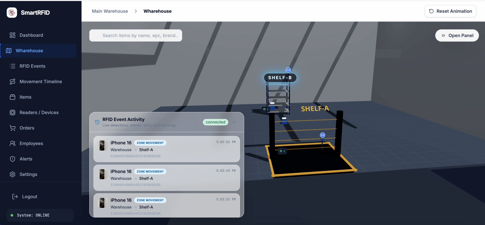
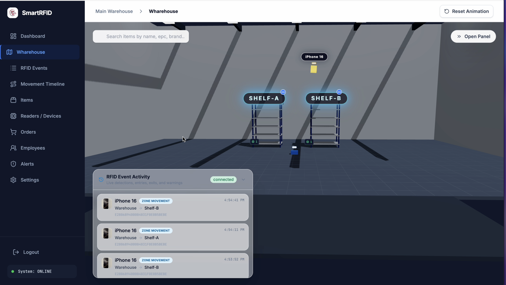

# Smart RFID Inventory System — Frontend

Smart RFID is a graduation project developed at Birzeit University to improve inventory accuracy and traceability in warehouses and laboratories. The complete system combines passive UHF RFID tracking, Raspberry Pi edge processing, centralized backend services, web and mobile applications, and computer-vision-assisted item registration.

The project addresses the errors and stale records common in manual and barcode-based inventory workflows. RFID-tagged items are detected automatically, assigned to logical warehouse zones, and reflected in the digital inventory in near real time. For new or untagged items, the companion mobile application uses image comparison and Gemini-assisted descriptions to help an employee create or match an inventory record. Human confirmation is required before CV or AI results change inventory data.

This repository contains the **frontend application**.

## Demo video

Watch the Smart RFID Inventory Tracking System demonstration:

[](https://youtu.be/-5AHoBTiLmA)

[Open the demo on YouTube](https://youtu.be/-5AHoBTiLmA)

## Screenshots

### Live RFID event monitoring

The warehouse view displays RFID detections, item movements, reader zones, and the live WebSocket connection status.



### Warehouse zone movement

The 3D simulation visualizes an item's movement between warehouse shelves and records each zone transition in the event panel.



## Graduation project

**Course:** ENCS5300 — Graduation Project

**Institution:** Birzeit University, Faculty of Engineering & Technology

**Department:** Electrical & Computer Engineering

**Supervisor:** Dr. Nofal Nofal

**Date:** July 2026

**Prepared by:**

- Kareem Alqutob — 1211756
- Ahmad Elayyan — 1210443
- Husain Abugosh — 1210338

## System architecture

The complete Smart RFID system is organized into four layers:

1. **Sensing layer:** Passive UHF RFID tags provide unique EPC identifiers, fixed readers detect tagged items, and a mobile camera captures images for assisted registration.
2. **Edge-processing layer:** Raspberry Pi devices collect reader data, filter repeated reads, add timestamps, extract signal information, and send structured detection events to the server.
3. **Backend-processing layer:** A FastAPI service applies inventory and order rules, updates zone allocation, records movements, authenticates employees, stores data in PostgreSQL, and broadcasts real-time events.
4. **Application layer:** This React dashboard supports centralized monitoring and administration, while the Flutter mobile app supports warehouse and security workflows.

The warehouse uses two reader roles:

- **Zone readers** cover shelves or storage areas and determine the logical location of inventory.
- **Gate readers** use a shorter, controlled range at entry and exit points to detect transitions and reduce false movement events.

The system intentionally tracks items by zone instead of attempting coordinate-level indoor localization. This keeps the deployment practical while supporting presence detection, quantities, movement history, and location allocation.

```text
RFID tags and readers
          │
          ▼
Raspberry Pi edge devices
          │  structured detection events
          ▼
FastAPI backend ───── PostgreSQL database
          │
          ├── REST API ───── React dashboard / Flutter mobile app
          └── WebSocket ──── live movements, approvals, and warnings

Mobile camera ── image matching / Gemini assistance ── employee confirmation
```

## Core workflows

- **Warehouse entry:** A gate reader detects incoming tags. Registered items are approved and added to inventory; unknown tags generate an operational warning for registration or mapping.
- **Zone allocation:** Storage readers detect tags, and the backend uses the strongest relevant signal and reader zone to update an item's current location.
- **Internal movement:** Moving an item between zones creates a movement event, updates its allocation, and broadcasts the change to connected clients.
- **Authorized exit:** An ordered item passing the exit gate is physically approved, its quantity is reduced, and order progress is updated.
- **Unauthorized exit:** An item leaving without an associated order creates a security warning instead of silently changing inventory.
- **New-item registration:** The mobile app compares an item photo with stored images. If confidence is insufficient, Gemini can suggest descriptive data; an employee reviews the result before saving it and assigning an RFID tag.

## Main features

- Secure employee login with admin, operations, and security roles
- Dashboard with inventory, reader, alert, and recent-detection summaries
- Interactive 3D warehouse visualization built with React Three Fiber
- Live RFID detections and movement updates over WebSockets
- Item and item-variant inventory browsing
- Item movement history by variant
- Raspberry Pi device and RFID reader creation and management
- Zone-aware reader configuration
- Order creation, filtering, inspection, and deletion
- Employee creation, editing, activation, and deletion
- Security alert review and resolution
- Configurable detection, missing-item, stolen-item, reader, and reconnect thresholds
- Responsive interface for desktop and mobile screens

## Technology stack

- React 19 and TypeScript
- Vite 6
- React Router
- Tailwind CSS 4
- Base UI and shadcn-style components
- React Three Fiber, Drei, and Three.js
- Recharts
- Motion
- Express for serving the production build

### Technologies used by the complete system

- FastAPI backend and REST API
- PostgreSQL database
- Python-based Raspberry Pi edge software
- Passive UHF RFID tags and UHF reader modules
- Raspberry Pi 4 devices
- Flutter/Dart mobile application
- Image similarity and Gemini-assisted item descriptions

## Requirements

- [Node.js](https://nodejs.org/) 22.x
- npm
- A running Smart RFID backend, unless you use the configured hosted backend

## Getting started

1. Clone the repository and enter the project directory.

2. Install dependencies:

   ```bash
   npm install
   ```

3. Create a local environment file:

   ```bash
   cp .env.example .env.local
   ```

4. Set the backend URL in `.env.local`:

   ```env
   VITE_API_BASE_URL=http://localhost:8000
   ```

5. Start the development server:

   ```bash
   npm run dev
   ```

6. Open [http://localhost:3000](http://localhost:3000).

Use an employee account configured in the backend to sign in.

## Environment variables

| Variable | Purpose | Required |
| --- | --- | --- |
| `VITE_API_BASE_URL` | Backend HTTP base URL. During development, Vite proxies `/api` and `/ws` requests to this address. | Recommended |
| `VITE_WS_BASE_URL` | Optional explicit WebSocket base URL for production, such as `wss://api.example.com`. When omitted, it is derived from `VITE_API_BASE_URL`. | No |
| `PORT` | Port used by the Express production server. Defaults to `3000`. | No |

The example environment file also contains AI Studio variables. They are not currently required by the frontend's inventory workflows.

> Do not commit real credentials or private keys to an environment file.

## Available commands

| Command | Description |
| --- | --- |
| `npm run dev` | Run the Vite development server on port 3000 |
| `npm run build` | Create an optimized production build in `dist/` |
| `npm run start` | Serve the production build with Express |
| `npm run preview` | Preview the Vite production build locally |
| `npm run lint` | Run TypeScript type checking without emitting files |
| `npm run clean` | Remove the generated `dist/` directory |

To test the production build locally:

```bash
npm run build
npm run start
```

## Application pages

| Route | Description |
| --- | --- |
| `/login` | Employee authentication |
| `/` | System overview and latest RFID detections |
| `/simulation` | Interactive 3D warehouse and live item movement view |
| `/events` | RFID event history |
| `/movement-timeline` | Movement history lookup for an item variant |
| `/items` | Inventory items, variants, and order creation |
| `/readers` | RFID reader and Raspberry Pi device management |
| `/orders` | Order search, filters, details, and management |
| `/employees` | Employee and access-role management |
| `/alerts` | Security alert review |
| `/settings` | Detection and connection timing configuration |

All application pages except `/login` require a stored authenticated employee session.

## Backend integration

The frontend expects REST endpoints for the following resources:

- Employees and login
- Items and variants
- Orders and order items
- RFID detections
- RFID readers
- Raspberry Pi devices
- Zones and zone summaries
- Movement timelines
- System settings

Live RFID updates are received from:

```text
/ws/rfid-events
```

In development, browser requests use `/api`, and Vite forwards them to `VITE_API_BASE_URL`. The WebSocket `/ws` path is proxied to the same backend. In production, REST calls use `VITE_API_BASE_URL` directly and WebSocket calls use `VITE_WS_BASE_URL` or a URL derived from the API address.

If item or event requests fail, the application can display limited mock data for those views. Features that create or update backend records still require a working API.

## Project structure

```text
.
├── components/ui/          # Reusable interface components
├── lib/                    # API helpers and shared utilities
├── public/                 # Static assets
├── src/
│   ├── components/layout/  # Main authenticated layout and navigation
│   ├── context/            # Inventory state, API loading, and live events
│   ├── data/               # Fallback mock data
│   ├── lib/                # Authentication storage helpers
│   ├── pages/              # Application pages
│   ├── types/              # TypeScript domain models
│   ├── App.tsx             # Routes and authentication guards
│   ├── config.ts           # API and WebSocket configuration
│   └── main.tsx            # Application entry point
├── server.js               # Production static-file server
├── vite.config.ts          # Vite, aliases, Tailwind, and proxy setup
└── railway.json            # Railway build and deployment settings
```

## Deployment

The repository includes Railway configuration. Railway builds the application with `npm run build` and starts it with `npm run start`.

For Railway or another production platform:

1. Set `VITE_API_BASE_URL` to the public backend URL at build time.
2. Optionally set `VITE_WS_BASE_URL` when the WebSocket service has a different public address.
3. Build the project with `npm run build`.
4. Start the Express server with `npm run start`.

The Express server serves the compiled single-page application and sends `index.html` for client-side routes.

## Prototype evaluation

The project report documents controlled end-to-end testing of the integrated prototype:

| Evaluation | Reported result |
| --- | --- |
| RFID detection and transmission | 108 of 113 events succeeded — approximately 95.6% |
| Backend workflow scenarios | 60 of 60 produced the expected result |
| Database consistency checks | 60 of 60 matched the expected state |
| Automatic real-time frontend updates | 56 of 60 events — approximately 93.3% |
| Observed real-time update delay | Approximately 1–2 seconds |
| CV-assisted matching | 32 of 40 images returned the correct or visually closest item — 80% |

These results describe a controlled prototype rather than a production-scale deployment. Identified limitations include reader interference, RSSI variation, network dependency, repeated-event load, limited deployment scale, and imperfect CV matching. Human confirmation remains part of registration and other sensitive workflows.

## Future improvements

- Test with more readers, Raspberry Pi devices, gates, shelves, items, and zones
- Improve reader synchronization and interference handling
- Use dedicated UART expansion hardware for larger installations
- Combine RSSI calibration, signal averaging, and zone filtering for more reliable allocation
- Use a specialized warehouse-item recognition model
- Add stronger authorization, auditing, and deployment security
- Buffer events for offline operation and synchronize after reconnection

## Notes

- Authentication data is stored in session storage, or local storage when “remember me” is selected.
- System settings are cached locally and synchronized with the backend settings endpoints.
- Dashboard, simulation, and event pages maintain a live RFID connection and also refresh event data periodically.
- The `@` import alias points to the repository root.

## License

No project license has been specified yet.
